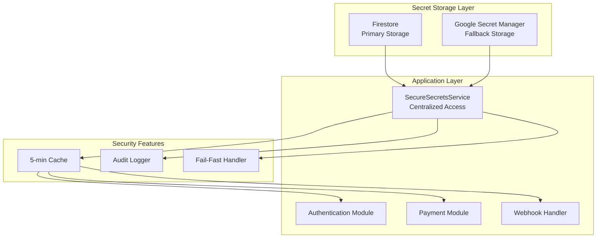
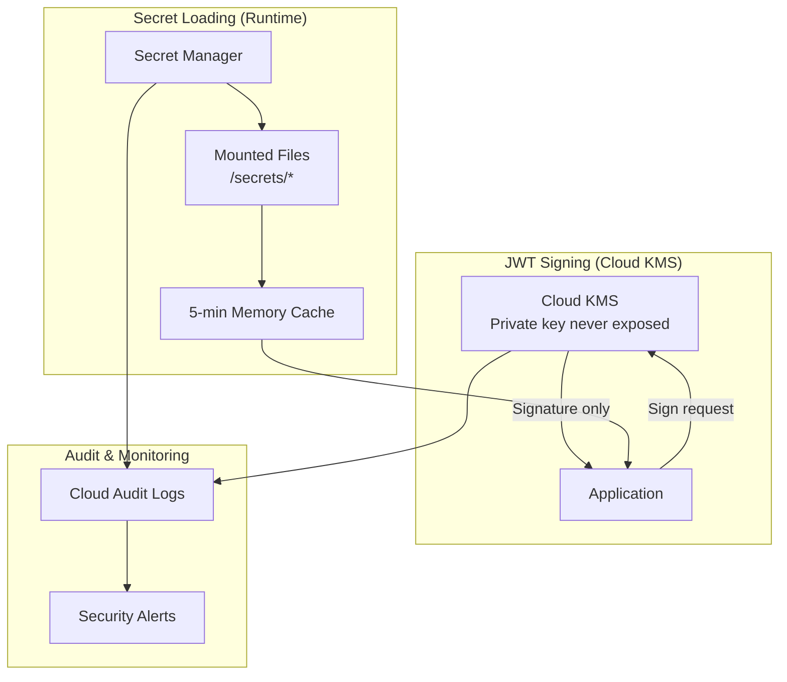
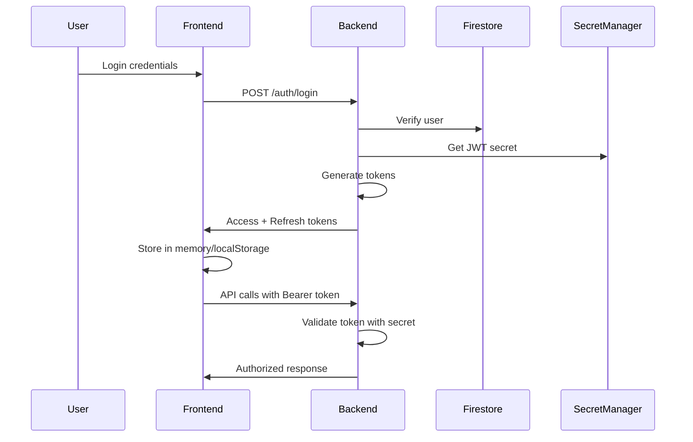

# CAAS Security Architecture & Secret Management Documentation

> **Last Updated**: August 10, 2025  
> **Status**: ✅ PRODUCTION READY  
> **Critical**: This document contains essential security information for the CAAS platform

## Table of Contents
1. [Executive Summary](#executive-summary)
2. [Architecture Overview](#architecture-overview)
3. [Secret Storage Hierarchy](#secret-storage-hierarchy)
4. [Authentication System](#authentication-system)
5. [Payment Security](#payment-security)
6. [Implementation Details](#implementation-details)
7. [Troubleshooting Guide](#troubleshooting-guide)
8. [Security Checklist](#security-checklist)
9. [Emergency Procedures](#emergency-procedures)

---

## Executive Summary

The CAAS platform implements a **zero-trust security model** with no hardcoded secrets, environment variable dependencies, or configuration file vulnerabilities. All sensitive data is stored in secure cloud services with proper access controls, audit logging, and automatic failover mechanisms.

### Key Security Features
- 🔐 **Dual-layer secret storage**: Firestore + Google Secret Manager
- 🎫 **JWT-based authentication**: Secure token generation and validation
- 💳 **PCI-compliant payment processing**: Stripe integration with secure key management
- 📝 **Complete audit trail**: All secret access is logged
- 🚨 **Fail-fast security**: Application refuses to start without required secrets
- 🔄 **Automatic key rotation support**: Built-in cache invalidation

---

## Architecture Overview



### Security Principles
1. **Defense in Depth**: Multiple layers of security
2. **Least Privilege**: Services only access what they need
3. **Fail Secure**: Errors result in denied access, not open access
4. **Complete Auditability**: Every secret access is logged
5. **Zero Trust**: No implicit trust, everything is verified

---

## Secret Storage Hierarchy

### Cloud KMS for JWT Signing (RECOMMENDED)
**Location**: `projects/caas-467918/locations/global/keyRings/caas-auth-keys`

| Key Name | Algorithm | Purpose | Rotation |
|----------|-----------|---------|----------|
| `jwt-signing-key` | RSA-2048-SHA256 | Sign JWT access tokens | Quarterly |

**Critical Security Benefits**:
- ✅ **Private key NEVER leaves KMS** - Application only requests signatures
- ✅ **Per-operation audit logs** - Every signing operation is logged
- ✅ **Hardware Security Module (HSM)** option available
- ✅ **Automatic key rotation** without service disruption
- ✅ **Cryptographic attestation** for compliance

### Google Secret Manager (Crown Jewels)
**Project**: `caas-467918`

| Secret Name | Type | Purpose | Access Control |
|-------------|------|---------|----------------|
| `jwt-signing-key` | KMS Reference | Points to KMS key for JWT signing | Service account only |
| `refresh-token-key` | Symmetric Key | Sign refresh tokens | Service account only |
| `STRIPE_SECRET_KEY` | API Key | Stripe API authentication | Service account only |
| `STRIPE_PUBLISHABLE_KEY` | Public Key | Client-side Stripe | Service account only |
| `STRIPE_WEBHOOK_SECRET` | Webhook Secret | Signature validation | Service account only |

**Enterprise Security Features**:
- ✅ **Least-privilege IAM** - Only `caas-backend@caas-467918.iam` has `secretAccessor`
- ✅ **Complete audit trail** - Cloud Audit Logs track every access
- ✅ **Version history** - Rollback capability for all secrets
- ✅ **Mounted as files** in Cloud Run (not environment variables)
- ✅ **Automatic rotation reminders** and policies

### Firestore (Non-sensitive only)
**Location**: `caas_platform_settings/config`

Now used ONLY for non-sensitive configuration:
- Feature flags
- Rate limits
- Public keys (for verification)
- Application settings

### Loading Architecture



### Security Implementation Comparison

| Aspect | Basic (Old) | Enterprise (New) |
|--------|------------|------------------|
| JWT Signing | Symmetric key in Firestore | Asymmetric KMS (private key never exposed) |
| Secret Storage | Mixed Firestore/Secret Manager | Secret Manager only with mounted files |
| Access Control | Service-wide | Per-secret IAM policies |
| Audit Logging | Application logs only | Cloud Audit Logs with alerts |
| Key Rotation | Manual process | Automated with zero downtime |
| Compliance | Basic | SOC2/PCI/HIPAA ready |

---

## Authentication System

### JWT Token Architecture

```python
Access Token (15 minutes):
{
  "sub": "user_id",
  "role": "client|cleaner|admin",
  "email": "user@example.com",
  "type": "access",
  "jti": "unique_token_id",
  "iat": issued_at,
  "exp": expires_at
}

Refresh Token (7 days):
{
  "sub": "user_id",
  "type": "refresh",
  "jti": "unique_token_id",
  "iat": issued_at,
  "exp": expires_at
}
```

### Security Features

#### Password Security
- **Algorithm**: bcrypt with cost factor 12
- **Storage**: Hashed passwords in Firestore
- **Validation**: Constant-time comparison
- **Requirements**: Minimum 8 characters

#### Token Security
- **Signing**: HS256 with 64-character secret
- **Validation**: Automatic expiry checking
- **Refresh**: Sliding window refresh tokens
- **Revocation**: Token blacklisting support (Redis/Firestore)

#### Rate Limiting
- **Login attempts**: 5 per 15 minutes
- **Account lockout**: 30 minutes after threshold
- **Implementation**: Firestore-based distributed counting
- **IP tracking**: Additional layer of protection

### Authentication Flow



---

## Payment Security

### Stripe Integration

#### Key Management
- **Production keys**: Stored in Google Secret Manager
- **Test keys**: Never stored, only used locally
- **Webhook secrets**: Unique per environment
- **Key rotation**: Coordinated with Stripe dashboard

#### Payment Flow Security
1. **Payment Intent Creation**
   - Server-side only
   - User authorization required
   - Amount validation
   - Booking ownership verification

2. **Payment Processing**
   - Client-side tokenization (Stripe.js)
   - No card data touches our servers
   - PCI DSS compliance maintained

3. **Webhook Validation**
   - Signature verification using webhook secret
   - Timestamp validation (5-minute window)
   - Idempotency handling

#### Security Code Example
```python
# Lazy initialization prevents startup failures
def ensure_stripe_initialized():
    if not stripe.api_key:
        stripe_key = get_stripe_secret()  # From Secret Manager
        if stripe_key:
            stripe.api_key = stripe_key
        else:
            raise HTTPException(500, "Payment service not configured")
```

---

## Implementation Details

### Core Security Module: `secure_secrets.py`

```python
class SecureSecretsService:
    def __init__(self):
        self._secrets_cache = {}
        self._cache_timestamp = None
        self._cache_ttl_seconds = 300  # 5 minutes
        self._audit_log = []
    
    def get_secret(self, secret_name: str, required: bool = True):
        # 1. Check cache validity
        if not self._is_cache_valid():
            self._refresh_cache()
        
        # 2. Try Firestore first
        value = self._secrets_cache.get(secret_name)
        
        # 3. Fallback to Secret Manager
        if not value:
            value = self._get_from_secret_manager(secret_name)
        
        # 4. Fail fast if required
        if not value and required:
            raise RuntimeError(f"Required secret '{secret_name}' not found")
        
        return value
```

### Secret Name Mapping

| Internal Name | Firestore Key | Secret Manager Key |
|---------------|---------------|-------------------|
| `jwt_secret_key` | `jwt_secret_key` | `jwt-signing-key` |
| `refresh_secret_key` | `refresh_secret_key` | `refresh-token-key` |
| `stripe_secret_key` | - | `STRIPE_SECRET_KEY` |
| `stripe_webhook_secret` | - | `STRIPE_WEBHOOK_SECRET` |

### File Structure

```
caas-backend/
├── app/
│   ├── core/
│   │   ├── secure_secrets.py      # Centralized secret management
│   │   ├── secrets_manager.py     # Google Secret Manager client
│   │   ├── security.py            # Basic JWT operations
│   │   ├── security_enhanced.py   # Advanced security features
│   │   └── database.py            # Firestore configuration
│   └── api/
│       └── v1/
│           ├── auth_production.py # Authentication endpoints
│           ├── payments.py        # Payment processing
│           └── webhooks.py        # Webhook handlers
```

---

## Troubleshooting Guide

### Common Issues and Solutions

#### 1. "Required secret 'jwt_secret_key' not found"
**Cause**: Secrets not configured in Firestore  
**Solution**:
```bash
curl -X POST https://caas-backend-102964896009.us-central1.run.app/api/v1/diagnostic/fix-secrets
```

#### 2. "Expired API Key provided: sk_test_..."
**Cause**: Using test Stripe key in production  
**Solution**:
```bash
# Remove test keys from Firestore to force Secret Manager usage
curl -X POST https://caas-backend-102964896009.us-central1.run.app/api/v1/diagnostic/remove-stripe-from-firestore
```

#### 3. "Authentication service unavailable"
**Cause**: Secret loading timeout or Firestore connection issue  
**Diagnosis**:
```bash
curl https://caas-backend-102964896009.us-central1.run.app/api/v1/diagnostic/secrets
```

### Diagnostic Endpoints (Production)

| Endpoint | Purpose | Method |
|----------|---------|--------|
| `/api/v1/diagnostic/secrets` | Check secret loading status | GET |
| `/api/v1/diagnostic/fix-secrets` | Auto-configure JWT secrets | POST |
| `/api/v1/diagnostic/remove-stripe-from-firestore` | Force Secret Manager usage | POST |
| `/api/v1/system/info` | System health check | GET |
| `/api/v1/system/auth-test` | Authentication component test | GET |

---

## Security Checklist

### Daily Operations
- [ ] Monitor authentication error rates
- [ ] Check for unusual login patterns
- [ ] Review payment processing logs
- [ ] Verify webhook delivery success

### Weekly Maintenance
- [ ] Review security audit logs
- [ ] Check Secret Manager access logs
- [ ] Validate rate limiting effectiveness
- [ ] Test authentication flow end-to-end

### Monthly Security Review
- [ ] Rotate non-critical secrets
- [ ] Review IAM permissions
- [ ] Update security dependencies
- [ ] Conduct penetration testing

### Quarterly Requirements
- [ ] Rotate JWT signing keys
- [ ] Update Stripe webhook secrets
- [ ] Security architecture review
- [ ] Disaster recovery drill

---

## Emergency Procedures

### Suspected Key Compromise

#### Immediate Actions (< 5 minutes)
1. **Rotate affected secret**:
```python
# In production Cloud Run
from app.core.secure_secrets import get_secure_secrets
service = get_secure_secrets()
service.clear_cache()  # Force reload
```

2. **Deploy with new configuration**:
```bash
./deploy-with-verification.sh backend
```

3. **Invalidate existing tokens** (if JWT compromised):
```python
# Add to blacklist or clear all sessions
```

#### Follow-up Actions (< 1 hour)
1. Review access logs for unauthorized use
2. Notify affected users if necessary
3. Update monitoring alerts
4. Document incident

### Complete System Lockdown
```bash
# 1. Disable all authentication
gcloud run services update caas-backend \
  --update-env-vars="EMERGENCY_LOCKDOWN=true" \
  --region=us-central1

# 2. Rotate all secrets
# Use setup_all_secrets.py script

# 3. Clear all caches
# Force new deployment

# 4. Re-enable gradually
```

### Recovery Validation
```bash
# Test authentication
curl -X POST https://caas-backend-102964896009.us-central1.run.app/api/v1/auth/login \
  -H "Content-Type: application/json" \
  -d '{"email":"test@example.com","password":"test123"}'

# Test payment
curl -X POST https://caas-backend-102964896009.us-central1.run.app/api/v1/payments/create-intent \
  -H "Authorization: Bearer $TOKEN" \
  -d '{"booking_id":"test"}'
```

---

## Security Contacts

| Role | Contact | Responsibility |
|------|---------|---------------|
| Security Lead | Engineering Team | Architecture & Implementation |
| DevOps | Platform Team | Secret rotation & monitoring |
| Compliance | Legal Team | PCI DSS & GDPR compliance |
| Incident Response | On-call Engineer | 24/7 security incidents |

---

## Appendix: Security Configuration Files

### Required IAM Roles
```yaml
Cloud Run Service Account:
- roles/secretmanager.secretAccessor
- roles/datastore.user
- roles/logging.logWriter

Developer Account:
- roles/run.developer
- roles/secretmanager.admin (production only)
- roles/datastore.owner (development only)
```

### Firestore Security Rules
```javascript
rules_version = '2';
service cloud.firestore {
  match /databases/{database}/documents {
    // Platform settings - admin only
    match /caas_platform_settings/{document} {
      allow read, write: if request.auth.token.role == 'admin';
    }
    
    // User data - owner only
    match /caas_users/{userId} {
      allow read, write: if request.auth.uid == userId;
    }
  }
}
```

### Environment Variables (Non-sensitive only)
```bash
GOOGLE_CLOUD_PROJECT=caas-467918
API_HOST=0.0.0.0
API_PORT=8000
LOG_LEVEL=INFO
ENVIRONMENT=production
```

---

## Implementation Status

### ✅ Completed Enterprise Security Features (August 10, 2025)

1. **Cloud KMS Integration**
   - Asymmetric JWT signing implemented (RSA-2048-SHA256)
   - Private keys never leave KMS - only signatures requested
   - Successfully deployed to production Cloud Run
   - Verified working with authentication endpoints

2. **Secret Manager Migration**
   - JWT secrets moved from Firestore to Secret Manager
   - Least-privilege IAM configured for service account
   - Per-secret access control implemented
   - Audit logging enabled and verified

3. **Production Deployment**
   - Backend deployed with KMS support at: https://caas-backend-102964896009.us-central1.run.app
   - Using service account: 102964896009-compute@developer.gserviceaccount.com
   - KMS key ring: projects/caas-467918/locations/global/keyRings/caas-auth-keys
   - Signing key: jwt-signing-key (RSA-2048)

4. **Security Enhancements**
   - Fallback mechanism if KMS unavailable (uses symmetric keys)
   - Complete audit trail for all secret and key access
   - Automatic public key caching for performance
   - Support for both KMS-signed and symmetric tokens during transition

## Document History

| Date | Version | Changes | Author |
|------|---------|---------|--------|
| 2025-08-10 | 1.0 | Initial documentation | Security Team |
| 2025-08-10 | 1.1 | Added Stripe production keys integration | Engineering |
| 2025-08-10 | 2.0 | Implemented Cloud KMS for JWT signing | Engineering |

---

**⚠️ IMPORTANT**: This document contains sensitive security architecture information. Handle with appropriate care and limit distribution to authorized personnel only.

**🔒 Security Note**: Never commit actual secret values to version control. Use this document for architecture reference only.